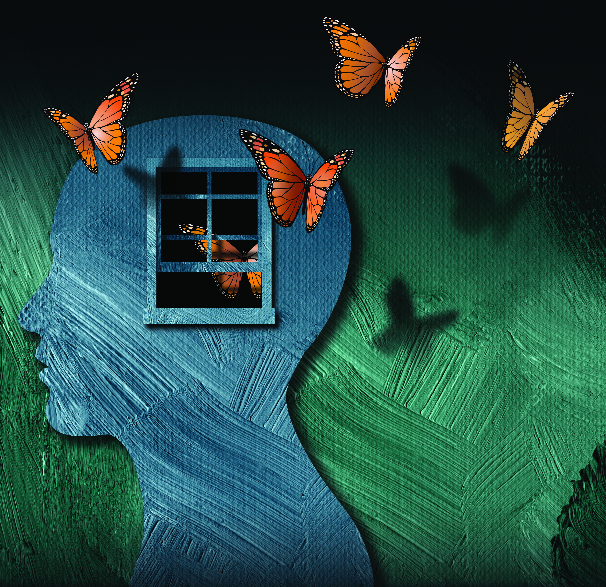
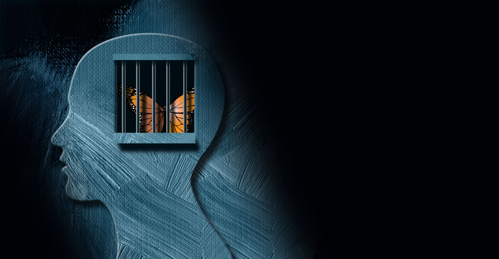
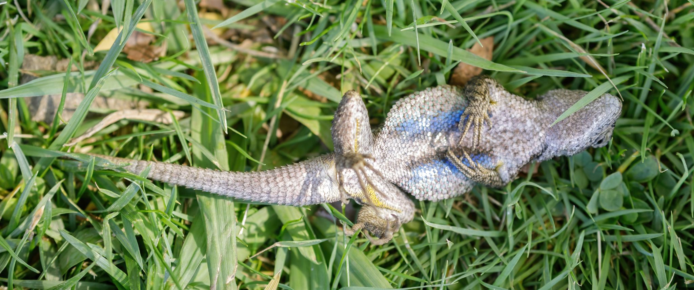
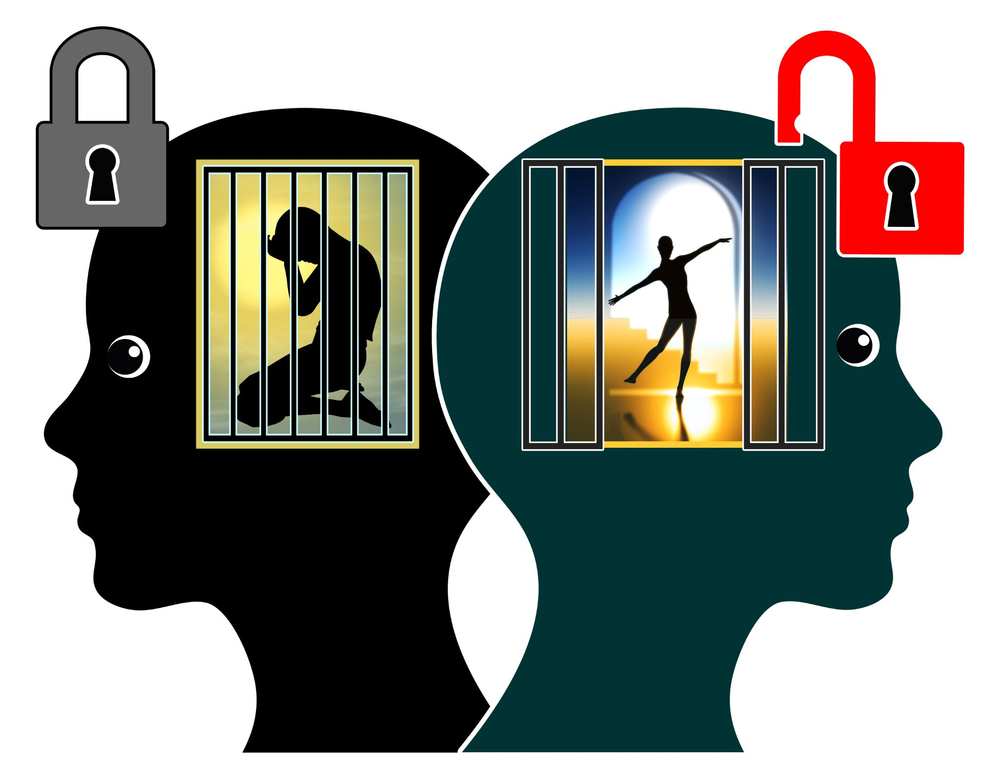
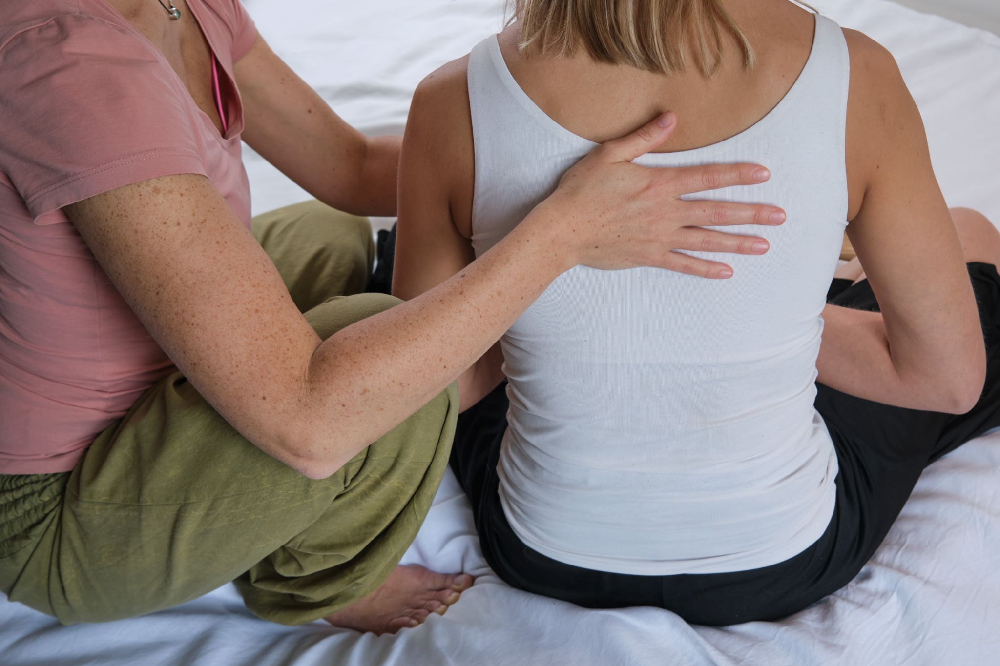

# Hành Trình Chữa Lành Cùng Liệu Pháp Trải Nghiệm Thân-Tâm®

## Mục lục

- Lời mở đầu
- Liệu Pháp Trải Nghiệm Thân-Tâm® Là Gì?
- 13 Lợi Ích Của Liệu Pháp Trải Nghiệm Thân-Tâm®
- Vì Sao Con Người "Bất Động" Khi Gặp Nguy Hiểm
- Các Kỹ Thuật Của Liệu Pháp Trải Nghiệm Thân-Tâm®
- Hiệu quả của liệu pháp trải nghiệm thân-tâm
- Kết luận
- Tài liệu tham khảo

---

## Lời mở đầu

Sống chung với chấn thương tâm lý thật sự rất kiệt sức. Ta dễ xem nhẹ những tổn thương mà biến cố và trải nghiệm đau đớn để lại trên cả thân thể lẫn tinh thần mình. Có những lúc, bạn không hiểu vì sao mình cứ căng thẳng, cứ không thể gượng dậy nổi. Bạn tự nhủ chắc tại thời tiết, tại chế độ ăn uống, hay tại những người xung quanh. Bạn trách công việc, hoặc một nếp sinh hoạt nào đó trong ngày. Trong khi đó, những dấu vết của tổn thương tâm lý vẫn âm thầm nằm lại trong cơ thể, và sẽ không tự rời đi cho đến khi bạn quay lại đối diện với những dấu vết ấy. Và bạn không phải đi qua điều này một mình.

Nhiều người nghĩ rằng một biến cố làm đảo lộn cuộc đời thì phải là một sự kiện duy nhất, như bị hành hung, bị xâm hại, một vụ xả súng hay một tai nạn kinh hoàng. Nhưng thực tế không đơn giản như vậy. Điều người này có thể bước qua nhẹ nhàng lại có thể để lại dấu ấn không phai trong lòng người khác suốt nhiều năm, chẳng hạn như mất việc, một mối quan hệ tan vỡ, hay sự ra đi của người thân. Cũng vậy, nhiều trải nghiệm nối tiếp nhau có thể dần dần chất chồng, để lại chấn thương tâm lý và cảm giác bất lực. Chỉ người trong cuộc mới thật sự hiểu mình đã bị ảnh hưởng như thế nào.

Cách một người cảm nhận trải nghiệm ấy, cùng câu chuyện họ kể cho chính mình về nó, là chìa khóa để hiểu họ hóa giải và chữa lành ra sao. Có thể họ vẫn còn nghe văng vẳng tiếng bố mẹ cãi nhau, hoặc gặp một tác nhân nào đó chạm vào vết cũ, cuốn trôi bao công sức họ đã nhọc nhằn gây dựng. Những căng thẳng chồng lên nhau ấy có thể làm suy yếu nghiêm trọng khả năng phục hồi, thứ cần có để tìm lại bình yên và được chữa lành.

Ngoài ra, niềm tin văn hóa và tôn giáo của mỗi người, trong nhiều trường hợp, định hình cách ta nhìn nhận những trải nghiệm tưởng chừng rất đỗi bình thường. Chính những chuẩn mực xã hội và hệ niềm tin ấy đôi khi lại gây thêm tổn thương, khi ta mang theo cảm giác xấu hổ và tội lỗi vì chưa đáp ứng được kỳ vọng của người khác. Hơn thế nữa, điều này rất dễ kích hoạt phản ứng "chiến hoặc chạy" của não bộ, khiến ta không còn nhìn thấy hết những khả năng và lối đi có thể dẫn đến sự thấu suốt và quyền làm chủ cuộc sống của chính mình.

Có nhiều cách để bạn xử lý cảm xúc và chữa lành tổn thương tâm lý. Liệu pháp trải nghiệm thân-tâm (Somatic Experiencing®) là một trong số đó.

Cơ thể bạn phản ứng với chấn thương tâm lý bằng những dấu hiệu dễ nhận thấy: cơ bắp căng cứng, đau bụng, thần kinh lúc nào cũng căng như dây đàn. Nhưng tác động còn sâu hơn thế rất nhiều, âm thầm bào mòn cả sức khỏe thể chất lẫn tinh thần của bạn: từ tâm trạng, giấc ngủ, cho đến cách bạn hình dung về tương lai của mình.

Vì những biểu hiện thể chất dễ nhận biết và dễ kiểm soát hơn, dù chúng phản ánh những tổn thương về mặt cảm xúc, nên liệu pháp trải nghiệm thân-tâm bắt đầu quá trình chữa lành bằng các bài tập thể chất.

Hãy cùng bắt đầu hành trình này bằng việc tìm hiểu về hướng trị liệu ấy: tác động của liệu pháp, và cách bạn đưa liệu pháp vào cuộc sống của mình.

---

## Liệu Pháp Trải Nghiệm Thân-Tâm® Là Gì?

Tiến sĩ Peter Levine đã xây dựng hướng tiếp cận này theo tinh thần tự nhiên, dựa trên sinh học thần kinh và lấy cơ thể làm trọng tâm, nhằm xoa dịu nỗi đau, tổn thương tâm lý, nỗi buồn mất mát và lo âu đang được cất giữ trong cơ thể chúng ta. Liệu pháp này khai thác sợi dây kết nối thân-tâm để chăm sóc cả những triệu chứng thể chất lẫn tâm lý của căng thẳng, chấn thương tâm lý, cùng những vấn đề sức khỏe tâm thần có thể kéo theo.

Cảm hứng của ông đến từ việc quan sát các loài vật trong môi trường tự nhiên, nơi chúng luôn đứng trước nguy cơ trở thành con mồi. Vậy mà, bằng một cách nào đó, chúng không hề mang những triệu chứng tổn thương tâm lý như con người. Tiến sĩ Levine nhận ra rằng khi đối diện nguy hiểm chết người, những con vật không thể chống trả hay thoát thân sẽ rơi vào trạng thái bất động và "giả chết".

Tuy nhiên, nguồn năng lượng dâng trào đáng lẽ dùng để tự vệ ấy cần được giải phóng ngay sau khi hiểm nguy qua đi. Thông thường, loài vật sẽ "rũ bỏ" bằng cách run rẩy hoặc làm một cử động cơ thể nào đó khác. Nếu bước này không diễn ra, nguồn năng lượng sẽ bị mắc kẹt trong cơ thể, và bạn vẫn cảm thấy như mình đang gặp nguy hiểm.

Liệu pháp trải nghiệm thân-tâm giải tỏa khối cú sốc chấn thương đang bị dồn nén ấy, đưa bạn ra khỏi trạng thái "mắc kẹt", và làm lặng đi tiếng chuông báo động vẫn vang lên trong đầu bạn. Để làm được điều này, liệu pháp lấy cơ thể làm điểm khởi đầu.

Chính vì vậy, khác với nhiều liệu pháp khác, bạn không cần nhớ lại chi tiết chính xác điều gì đã xảy ra với mình. Nếu chấn thương tâm lý xảy ra từ thuở nhỏ, kéo dài trong nhiều năm tháng, hoặc trong lúc bạn chịu áp lực cực độ, có khi bạn thậm chí không biết chính xác mình đã trải qua điều gì. Bạn có thể tập trung vào những gì mình đã cảm thấy, và đang cảm thấy lúc này.

Như Tiến sĩ Levine nói: "Bạn không cần biết những dữ kiện trong câu chuyện của mình để có thể viết lại các triệu chứng hay kết quả." Thay vào đó, trọng tâm được đặt vào cảm giác bị mắc kẹt của bạn, làm nhạt đi sức nặng của câu chuyện bạn vẫn tự kể cho mình, rồi vẽ lại bản đồ ký ức của cơ thể để bạn lại thấy sự sống tràn đầy trong mình.

Liệu pháp trải nghiệm thân-tâm giúp thân chủ lắng nghe những gì đang diễn ra trong cơ thể mình, bằng cách chậm lại và đồng thời đánh thức nhận thức về bản thân cùng lòng tự tin. Khi trở lại với một cơ thể từng bị tổn thương hoặc phân ly, theo nhịp độ của riêng mình, họ thay đổi và chữa lành từng bước, một cách an toàn.

---

## 13 Lợi Ích Của Liệu Pháp Trải Nghiệm Thân-Tâm®

Liệu pháp trải nghiệm thân-tâm giúp mỗi người tạo ra những trải nghiệm mới trong chính cơ thể mình, giải thoát họ khỏi cảm giác căng cứng và nỗi bất lực choáng ngợp. Liệu pháp hướng đến việc khám phá những cảm giác nằm bên dưới các cảm xúc, niềm tin và cả những thói quen đang củng cố những cảm xúc, niềm tin đó.

Bằng cách tạo ra những phản ứng vận động mang tính tự vệ và "rũ bỏ" nguồn năng lượng sinh tồn còn mắc kẹt trong cơ thể, liệu pháp chạm đến gốc rễ của các triệu chứng tổn thương tâm lý và đưa con người trở về với trạng thái tự nhiên của mình. Khi được thực hiện đúng cách, thân chủ có thể nhận thấy những lợi ích sau:

### Những lợi ích chính

- Tập trung tốt hơn
- Lòng tự trọng cao hơn
- Giảm đau nhức cơ thể
- Mức căng thẳng và sự bất an trong lòng giảm bớt
- Ít những tâm trạng và cảm xúc tiêu cực hơn, như lo âu, lo lắng, tội lỗi, xấu hổ và giận dữ
- Bớt cáu gắt và/hoặc hung hăng
- Nhiều cảm xúc tích cực hơn, như niềm vui, sự hứng thú và sự tỉnh táo
- Tự tin hơn
- Niềm hy vọng và khả năng phục hồi mạnh mẽ hơn
- Cảm thấy khỏe khoắn về thể chất
- Mối quan hệ với gia đình và bạn bè gắn kết hơn
- Giấc ngủ sâu và ngon hơn
- Thêm tò mò và hứng thú với các hoạt động

---

## Vì Sao Con Người "Bất Động" Khi Gặp Nguy Hiểm

Đôi khi, cơ thể không biết cách phân biệt chấn thương thể chất với tổn thương tâm lý. Khi bạn ở trong trạng thái "chiến hoặc chạy", hệ thần kinh giao cảm sẽ đẩy nhanh nhịp tim, nhịp thở và tăng sự cảnh giác của bạn. Một khi thoát khỏi tình huống đáng sợ và đến được nơi an toàn, bạn có thể "đặt lại" trạng thái thể chất của mình.

Nhưng với tổn thương cảm xúc, não bộ có thể cứ lặp đi lặp lại từng mảnh vụn của trải nghiệm bị mắc kẹt ấy, khiến bạn cũng mắc kẹt theo, và vẫn tin rằng mình có thể rơi trở lại vào hiểm nguy. Trạng thái quá nhạy cảm này thường dẫn đến rối loạn điều hòa cảm xúc.

Phản ứng bất động có thể biểu hiện theo nhiều cách:

- Về thể chất – Cảm giác tê liệt, nhịp thở và nhịp tim chậm lại, cơ bắp mất phối hợp
- Về nhận thức – Không thể tập trung, rối trí, và cảm giác như mình đang tách khỏi cơ thể

Điều này thường gặp khi một người nhận ra mình không thể thoát khỏi mối đe dọa bằng cách chiến hoặc chạy. Họ có thể bị dồn vào đường cùng, hoặc nhỏ bé hơn đối phương về thể chất. Hoặc họ nhận ra một khuôn mẫu khiến mình trở nên bất lực, chẳng hạn như một người bạn đời bạo hành, rồi cố định phản ứng ấy thành một cơ chế đối phó (coping mechanism).

---

## Các Kỹ Thuật Của Liệu Pháp Trải Nghiệm Thân-Tâm®

Hướng tiếp cận nhẹ nhàng này trải qua nhiều giai đoạn, sau buổi trao đổi ban đầu và đánh giá sức khỏe tổng thể. Ba giai đoạn dưới đây phản ánh nhịp dao động giữa căng thẳng và bình yên, cho đến khi thân chủ vượt qua chấn thương tâm lý của mình:

### Kết nối nguồn lực (Resourcing)

Kỹ thuật này còn được gọi là "tiếp đất" (grounding). Đây là cách gợi lại những ký ức đẹp về một nơi chốn, một con người hay một món đồ thân thương, để chạm vào cảm giác về sức mạnh nội tại, khả năng phục hồi và sự bình yên mỗi khi thân chủ thấy bị kích hoạt hoặc xáo động. Điều này giúp xoa dịu người ấy khi họ quay lại với những cảm giác của tổn thương tâm lý, hoặc những ký ức về một biến cố hay chuỗi biến cố.

### Chuẩn độ (Titration)

Đây là một tiến trình diễn ra dần dần, mô phỏng quy trình hóa học tìm ra lượng chất kích thích hoặc chất độc vừa đủ để gây ra phản ứng. Ở đây, nhà trị liệu làm chậm quá trình khám phá cảm xúc, để thân chủ đối diện với từng khía cạnh của chấn thương tâm lý khi họ cảm thấy đủ sức đón nhận, mà không bị kích hoạt trở lại.

Qua từng chu kỳ, năng lượng sinh tồn bị nén chặt được giải phóng chậm rãi, nhờ một tiến trình lặp lại đều đặn, nhịp nhàng: lắng nghe những cảm giác bên trong – như co rút lại hay vươn ra, dễ chịu hay đau đớn – trong khi vẫn ở lại với hiện tại.

### Dao động (Pendulation)

Giai đoạn chuyển tiếp này vận hành giữa sự bình yên của kết nối nguồn lực và việc đẩy giới hạn qua chuẩn độ. Khi thân chủ dao động giữa trạng thái bị kích thích và cảm giác an toàn, họ dần đạt đến trạng thái cân bằng tự nhiên, nơi họ không còn thấy bị choáng ngợp nữa.

Trong giai đoạn này, thân chủ có thể bật khóc, run rẩy hoặc rùng mình để giải phóng nguồn năng lượng đang mắc kẹt trong cơ thể. Nhà trị liệu có thể điều hòa việc này bằng các bài tập hơi thở hoặc một số kỹ thuật thư giãn khác nhau, để thân chủ đi vào trạng thái dòng chảy, đưa họ đến một bến bờ an toàn.

Nhà trị liệu có thể gợi ý những hành động tự xoa dịu để làm dịu hệ thần kinh trong những lúc căng thẳng leo thang. Mỗi thân chủ có thể có cách riêng mình ưa thích, nhưng dưới đây là một vài gợi ý:

- Nhớ lại một khoảnh khắc được đối xử tử tế, cùng những cảm xúc dễ chịu đi kèm khoảnh khắc ấy
- Nhớ lại một lúc bạn cảm thấy thoải mái khi bày tỏ chính mình một cách tự do, được là chính mình
- Tạo ra những âm thanh êm dịu, vang lên trong cơ thể để giải phóng năng lượng bị mắc kẹt theo từng chút nhỏ

Ở một quy mô nhỏ hơn, các nhà trị liệu sử dụng một khung tiếp cận gọi là SIBAM – Cảm giác (Sensation), Hình ảnh (Imagery), Hành vi (Behavior), Cảm xúc (Affect) và Ý nghĩa (Meaning).

### Khung tiếp cận SIBAM

#### Cảm giác (Sensation)

Quá trình trị liệu bắt đầu bằng việc giúp thân chủ nhận biết rõ hơn những cảm giác trong cơ thể mình, dù những cảm giác ấy có thể không dễ chịu hoặc phản ứng không như họ nghĩ. Khi hiểu được hệ thần kinh tự chủ của mình vận hành ra sao, thân chủ sẽ dần nhận ra mối liên hệ giữa các triệu chứng và những cảm xúc bị dồn nén trở nên rõ ràng hơn. Tùy vào trải nghiệm, họ có thể cảm thấy nặng nề hay nhẹ bẫng, nóng hay lạnh, chóng mặt hay tê liệt.

**Lưu ý:** Hình thức trị liệu này có thể liên quan đến việc chạm vào cơ thể. Nếu thân chủ cảm thấy không thoải mái khi được chạm vào, họ nên cho nhà trị liệu biết.

#### Hình ảnh (Imagery)

Tiếp theo, nhà trị liệu có thể "dẫn dắt" thân chủ qua một cảnh tượng tưởng tượng có hướng dẫn, để quan sát cách họ phản ứng trước "nguy hiểm". Những gì diễn ra trong cuộc trò chuyện khi thực hiện bài tập này có thể hé lộ manh mối về các tác nhân kích hoạt.

#### Hành vi (Behavior)

Bên cạnh những gì thân chủ nói ra, nhà trị liệu cũng quan sát ngôn ngữ cơ thể hoặc tư thế của họ trong suốt buổi trị liệu. Điều này có thể bao gồm những thay đổi trong nhịp thở hoặc tình trạng cơ bắp co cứng.

#### Cảm xúc (Affect)

Yếu tố này xét đến cách thân chủ bộc lộ cảm xúc qua từ ngữ họ chọn dùng, tốc độ nói, và ngữ điệu họ sử dụng.

#### Ý nghĩa (Meaning)

Bước này đòi hỏi thân chủ tự nhìn lại chính mình, để nhận ra họ cảm nhận quá trình trị liệu đang diễn tiến ra sao, và ý nghĩa nào nảy sinh từ những trải nghiệm của họ.

---

## Hiệu quả của liệu pháp trải nghiệm thân-tâm

Cho đến nay, lượng nghiên cứu đã công bố về liệu pháp trải nghiệm thân-tâm vẫn còn khá hạn chế, nhưng một vài trong số đó đã cho thấy kết quả rất hứa hẹn. Nhìn chung, một bài tổng quan tài liệu năm 2015 về tâm lý trị liệu lấy cơ thể làm trọng tâm kết luận rằng những can thiệp dạng này "đã được chứng minh là hiệu quả với nhiều nhóm đối tượng và bối cảnh khác nhau."

Chẳng hạn, trong một nghiên cứu, liệu pháp trải nghiệm thân-tâm đã giúp 44% người tham gia thoát khỏi rối loạn căng thẳng sau sang chấn (PTSD). Tương tự, sau trận sóng thần tại Ấn Độ năm 2004, 150 người tham gia đã trải qua một đợt trị liệu. Tám tháng sau, 135 người trong số đó cho biết các triệu chứng đã giảm đáng kể, thậm chí có trường hợp không còn triệu chứng nào.

---

## Kết luận

Tiến sĩ Levine dựa rất nhiều vào công trình nghiên cứu của Nikolaas Tinbergen, nhà khoa học đoạt giải Nobel, về hành vi sinh tồn của loài vật, để hoàn thành luận án tiến sĩ năm 1976 của mình. Câu nói sau nói lên rất nhiều điều về cuộc sống của chúng ta, ngay cả ở thời điểm hiện tại: "Chính sự thiếu khả năng thích nghi với căng thẳng của chúng ta – căng thẳng theo bất kỳ nghĩa nào – là điều có thể gây xáo trộn trọng yếu nhất trong xã hội hiện tại."

Khai mở tiềm năng ấy, bằng cách hóa giải giới hạn này, thật sự có thể thay đổi cả thế giới — từng người một.

---

## Tài liệu tham khảo

- https://www.verywellmind.com/what-is-somatic-experiencing-5204186#toc-techniques
- https://traumahealing.org/se-research-and-articles/
- https://www.healthline.com/health/somatic-experiencing
- Accumulated Stress, Reserve Capacity and Disease, luận án tiến sĩ của Peter A. Levine, năm 1976, Đại học California – Berkeley
